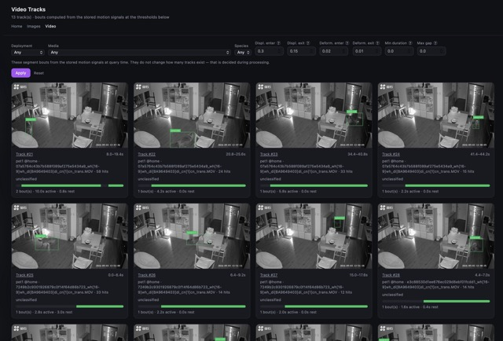
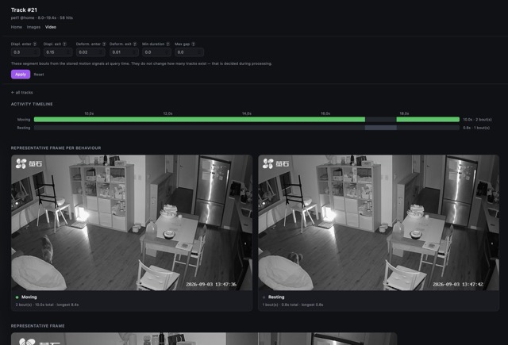

# AniDetector

A wildlife detection pipeline for camera-trap **stills** and **thermal video**.

**Images** -> ingest a folder -> MegaDetectorV6 (via PytorchWildlife) -> filter blank
frames -> SpeciesNet on each animal box.

**Video** -> register a folder -> decode with PyAV -> sample -> detect -> SORT tracking
-> per-track motion signals -> activity bouts -> a representative frame per track,
classified by the same SpeciesNet queue the stills go through.

Both persist to PostgreSQL and are exposed over a DRF API plus a minimal results page.

Stack: Django + DRF · PostgreSQL · PytorchWildlife/MegaDetectorV6 · SpeciesNet ·
PyAV · supervision · Pillow · NumPy · Celery + Redis · uv · Docker.

<table>
  <tr>
    <td align="center">
      <br/>
      <sub>home</sub>
    </td>
    <td align="center">
      <br/>
      <sub>image</sub>
    </td>
  </tr>
  <tr>
    <td align="center">
      <br/>
      <sub>video</sub>
    </td>
    <td align="center">
      <br/>
      <sub>track detail</sub>
    </td>
  </tr>
</table>

## Roadmap

### Done
1. Celery + Redis, Docker Compose entry — *completed in 2026.07.28*
2. Species identification via SpeciesNet — *completed in 2026.08.06*
3. Thermal video decoding and frame extraction; ML core and inference lifted out
   of the Django app into a standalone `inference` package — *completed in 2026.09.04*
4. SORT tracking with a Kalman filter; per-track displacement and deformation
   signals — *completed in 2026.09.04*
5. Activity bouts from stored motion signals, with hysteresis, gap bridging and a
   sensitivity sweep — *completed in 2026.09.04*
6. One representative frame per track, selected online during the decode pass and
   routed into the existing image species queue — *completed in 2026.09.04*
7. Package split: `core` (models) ← `inference` (no Django) ← `image` / `video`,
   with the dependency arrows enforced by a test — *completed in 2026.09.04*
8. Measure Detector throughput: A 12 h night takes 5.5 h, with
   `golden_value/benchmark_hot_path.py` on the pet set (M-series MPS, 5 fps
   sampling): decode and sampling run at ~325 fps, 60x realtime and 3% of loop
   time, while the detector forward pass is 88 ms/frame and the other 97%.
   — *completed in 2026.09.07*
9. Replace SORT with ByteTrack: keep low-confidence detections for a second
   association pass, which is where SORT loses animals to partial occlusion.
   See updates on `tracking.py` — *completed in 2026.09.07*
10. Pet-set validation run end to end. — *completed in 2026.09.07*

> Event clustering over stills was built and then removed: grouping photos by
> capture-time gap produced groupings with no biological meaning. Clustering
> returns in M3, over tracks rather than images.

### Next
11. **Enhance Detector throughput.** Real batching means first fixing upstream's
   `batch_image_detection`, which divides x by the image *height* and y by the
   *width*. That leaves the model: quantisation, ONNX Runtime or CoreML, or a
   smaller variant.

12. **TW-FINCH** cluster wildlife behaviors and naming with local VLM.
   Refer to: https://arxiv.org/abs/2103.11264
13. Change-point detection over tracks, and event clustering built on it.


## First-time Use

Prereqs: `uv`, Docker Desktop.

**Install Docker Desktop** (then sign in):
```bash
brew install --cask docker
```

**Start services (Postgres + Redis) with Docker Compose.** Compose and Django
both read the same `.env`:
```bash
cp .env.example .env
docker compose up -d          # starts anidetector-pg + anidetector-redis
```

**Install deps and set up the database:**
```bash
uv sync                          # creates .venv, installs deps
uv run python manage.py migrate
uv run python manage.py runserver
```

Success criterion: `docker compose up -d` brings both containers up, `migrate`
completes, and `runserver` starts. The schema lives in `core/models.py`
(see the diagram at the bottom).

**Validate the detector in isolation (no Django):**
```bash
uv run python golden_value/try_models.py example_images/01.webp
```

**Validate the SpeciesNet classifier in isolation:**
```bash
uv run python golden_value/try_speciesnet.py example_images/01.webp --threshold 0.5
```

**Measure the decode → detect throughput** (also no Django, no database). The
recorded run is `golden_value/baseline_mps.json`; `--check` re-runs and fails if
throughput drops more than 20%, and refuses to compare across devices:
```bash
uv run python golden_value/benchmark_hot_path.py <video> --device mps
uv run python golden_value/benchmark_hot_path.py <video> --device mps --check golden_value/baseline_mps.json
```

## Daily Use

**Step 0 — start infra + web:**
```bash
docker compose up -d                       # Postgres + Redis
uv run python manage.py runserver          # Django on http://127.0.0.1:8000
```

**Step 1 — create a Deployment.** Both pipelines hang off one: a camera at one
location over one stretch of time. Camera id, location and country are human
knowledge, not something a directory tree carries, so nothing infers them.
Create it in `/admin`, or:
```bash
uv run python manage.py shell -c "
from django.utils import timezone
from core.models import Deployment
print(Deployment.objects.create(
    camera_id='cam1', location='backyard', country='USA',
    start_ts=timezone.now(),
).id)"
```

**Step 2a — images:**
```bash
uv run python manage.py ingest <folder> --deployment <id>   # detect + persist
uv run python manage.py classify_species                    # SpeciesNet on animal boxes
```
`ingest` takes `--retry-failed` to redo failures, `--limit` to cap new rows.

**Step 2b — video:**
```bash
uv run python manage.py register_video <folder> --deployment <id>
uv run python manage.py process_video                       # decode -> tracks + signals
uv run python manage.py activity_report                     # bouts and activity budgets
```

Add `--contiguous` to `register_video` when the files are one recording the camera
split up, in filename order; that sets each `start_offset_ts` from the accumulated
durations. It is off by default because inferring contiguity that is not there
produces a silently wrong timeline.

`process_video` writes one representative frame per track and enqueues it for
species classification automatically — no second command needed, as long as a
Celery worker is running.

`activity_report` takes every threshold as an argument rather than a setting
(they are query parameters, not a property of the data), plus `--sensitivity` to
sweep them instead of reporting one setting:
```bash
uv run python manage.py activity_report --displacement-enter 0.5 --min-duration 1.0
uv run python manage.py activity_report --sensitivity --json out.json
```

**Async classification via Celery** — start a worker, then enqueue with `--async`:
```bash
uv run celery -A config worker -l info --pool=solo   # see note below
uv run python manage.py classify_species --async     # enqueue instead of running inline
```

> **macOS / GPU note:** the default `prefork` pool `fork()`s worker processes,
> and PyTorch **MPS (Metal)** and **CUDA** are not fork-safe — the worker crashes
> with `SIGABRT` the moment it touches the GPU. Use `--pool=solo` (single process,
> no fork) or `-P threads`. If a worker dies mid-batch, its detections are left in
> `processing`; re-run with `classify_species --retry-failed` to requeue them.

**Step 3 — view results:**
- `http://127.0.0.1:8000/results` — rendered gallery (stills only)
- `http://127.0.0.1:8000/results/<id>/annotated.png` — boxes + species drawn on one image
- `http://127.0.0.1:8000/admin` — Django admin
- `http://127.0.0.1:8000/api/images/` — image + detection + species JSON
- `http://127.0.0.1:8000/api/video/tracks/<id>/` — track detail: species, bout
  timeline and per-behaviour images
- `http://127.0.0.1:8000/api/video/tracks/<id>/behaviour/active.jpg` — a
  representative frame for the moving (or `rest.jpg`, resting) behaviour, extracted
  on demand for the thresholds in the query string and cached against them

## Package layout

```txt
core       ← models, taxonomy, box drawing. Imports nothing of ours.
inference  ← model loading and inference. No Django import anywhere.
image      ← the stills workflow. May import core + inference.
video      ← the video workflow. May import core + inference.
```

`image` and `video` never import each other; they meet at the `core.Detection`
table. `tests/test_boundries.py` enforces all of this as an executable rule.

## Data Structure

```txt
                        ┌───────────────────────────┐
                        │        Deployment         │
                        │───────────────────────────│
                        │ camera_id / location      │
                        │ country / modality        │
                        │ start_ts / end_ts         │
                        └─────┬───────────────┬─────┘
                         1:N  │               │  1:N
              ┌───────────────┘               └───────────────┐
              ▼                                               ▼
┌──────────────────────────┐                    ┌───────────────────────────┐
│          Image           │                    │           Media           │
│──────────────────────────│                    │───────────────────────────│
│ path (unique)            │                    │ path (unique) / kind      │
│ source: ingest |         │                    │ uploaded_at               │
│         video_frame      │                    │ fps / duration / gop_size │
│ captured_at              │                    │ start_offset_ts           │
│ width / height           │                    │ width / height / status   │
│ status / is_blank        │                    └─────────────┬─────────────┘
└────────────┬─────────────┘                              1:N │
         1:N │                                                ▼
             ▼                                  ┌───────────────────────────┐
┌──────────────────────────┐                    │           Track           │
│        Detection         │                    │───────────────────────────│
│──────────────────────────│                    │ media (FK→Media)          │
│ image (FK→Image)         │◄───rep_detection───┤ start_frame / end_frame   │
│ category                 │                    │ start_ts / end_ts / hits  │
│  (person/vehicle/animal) │                    │ rep_ts                    │
│ bbox_x1..y2              │                    └─────────────┬─────────────┘
│ confidence               │                              1:N │
│ status (species queue)   │                                  ▼
└────────────┬─────────────┘                    ┌───────────────────────────┐
         1:N │                                  │       MotionSignal        │
             ▼                                  │───────────────────────────│
┌──────────────────────────┐                    │ track (FK→Track)          │
│  SpeciesClassification   │                    │ ts                        │
│──────────────────────────│                    │ displacement_bl_per_s     │
│ detection (FK→Detection) │                    │ deformation_score         │
│ source (speciesnet/human)│                    │ confidence                │
│ category (species label) │                    │ bbox_x1..y2               │
│ confidence / top_k       │                    └───────────────────────────┘
│ model_version            │
│ annotator (FK→User)      │
└──────────────────────────┘
```

Two things in that diagram carry most of the design:

**A track's representative frame is an `Image` with one `Detection` on it.** That
is why a track gets classified by the stills species queue with no video-specific
code, and why `annotated.png` draws boxes on it for free. `Image.source` keeps
those frames out of the photo gallery.

**There is no Bout table.** Bouts are computed from `MotionSignal` at query time,
because thresholds are argued about and storing the verdict would mean re-decoding
terabytes every time one changes. `SpeciesClassification` is append-only for the
same reason: re-running a model version leaves history rather than overwriting it.
